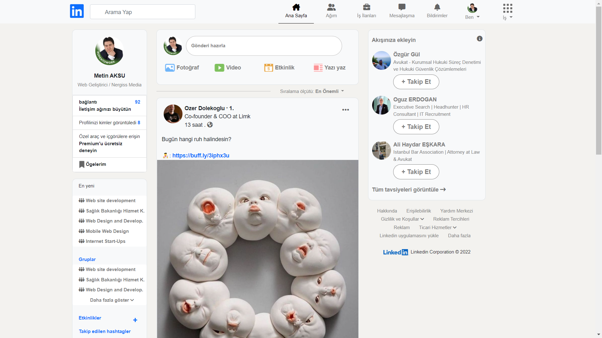

# Patika # İnstagram Clone Ödevi

Verilen ödevde direk instagramdan çekilen resimler kaybolmuştu. Bende sonrasında görsel olarak çirkin görünmesin diye, hepsini direk internetten bulup assets klasörüne yükledim. 

Ödevde istenen değişiklikleri yaptım. Aslında düzeltilmesi gereken çok fazla inline CSS vardı. Bir yere toplanması gerekiyordu. Ama öyle bıraktım. Gerçek senaryoda hemen hemen hiç inline css olmamalıydı. Gerçeğini kodlarsam tüm css kodlarını tek dosyada toplarım.

